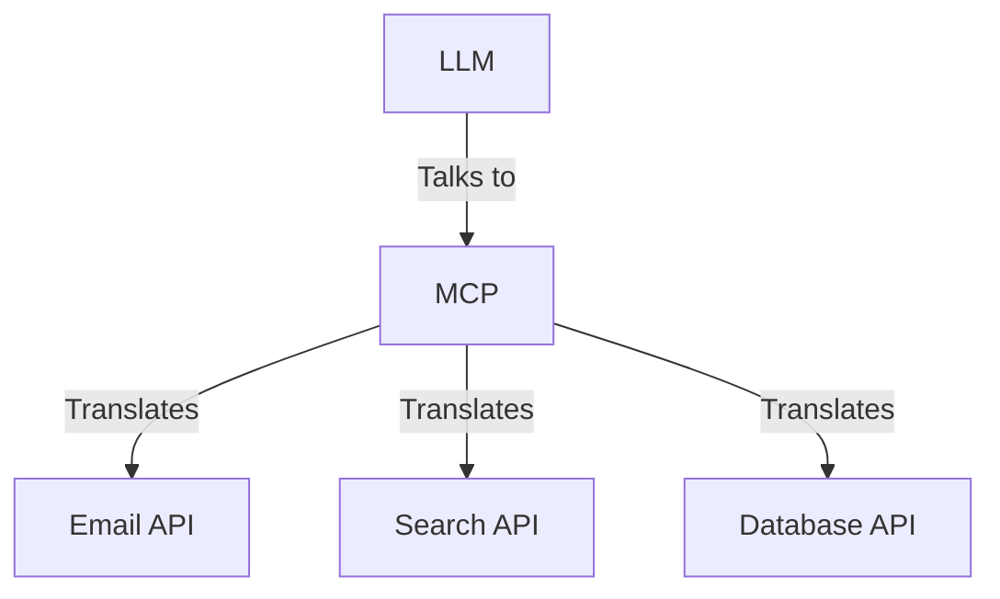
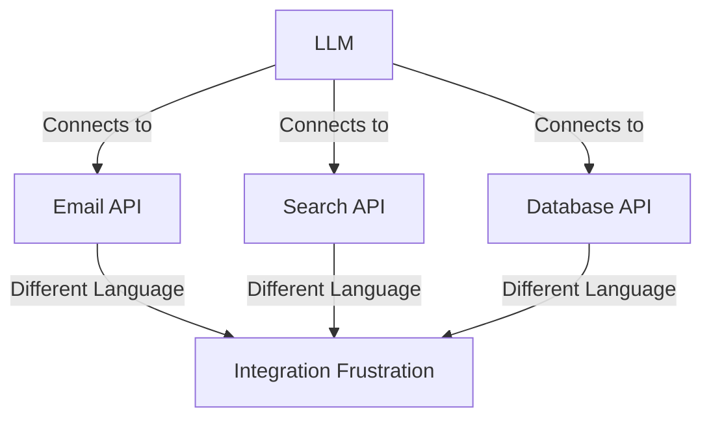
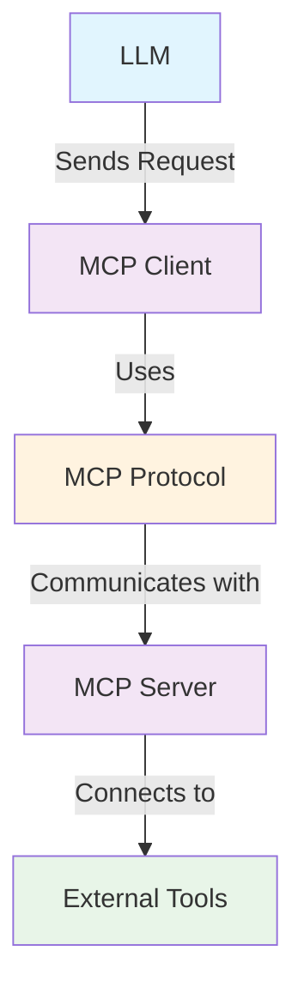
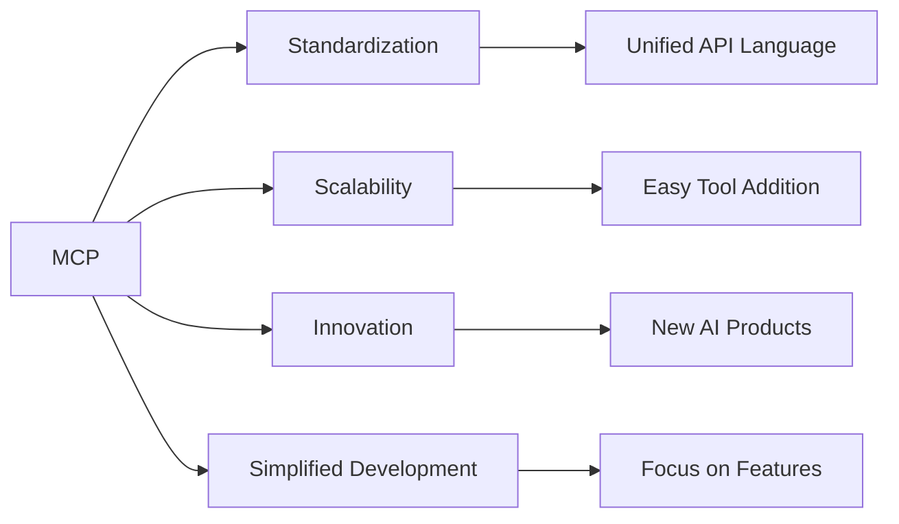

### ✅ What is MCP (Model Context Protocol)?

**Model Context Protocol (MCP)** is a standardized communication protocol that acts as a **universal translator** between Large Language Models (LLMs) and external tools or services.

It solves the fundamental problem of LLMs being great at generating text but unable to interact with the real world on their own.



---

### 📌 The Problem MCP Solves

Before MCP, connecting LLMs to external tools was a nightmare:

1. **LLMs can't do anything meaningful alone**:
   * They generate text but can't send emails, search the web, or access databases.

2. **Every tool speaks a different "language"**:
   * APIs have unique formats and requirements.
   * Integrating multiple tools becomes messy and time-consuming.

3. **No standardization**:
   * Each integration is a custom, one-off solution.



---

### ✅ How MCP Works

The MCP ecosystem consists of four key components:

1. **MCP Client**: The LLM-facing side that interacts with the protocol
2. **MCP Protocol**: The standardized communication layer
3. **MCP Server**: The tool-facing side that translates capabilities
4. **External Tools**: APIs or services (email, search, databases)



---

### 🔧 MCP Architecture Example

```javascript
// MCP Server Example
class EmailMCPServer {
  async handleRequest(request) {
    switch (request.method) {
      case 'send_email':
        return await this.sendEmail(request.params);
      case 'list_emails':
        return await this.listEmails(request.params);
    }
  }
  
  async sendEmail(params) {
    // Translate MCP request to email API call
    const result = await emailAPI.send({
      to: params.recipient,
      subject: params.subject,
      body: params.message
    });
    
    return { success: true, messageId: result.id };
  }
}
```

---

### 🆚 Before vs After MCP

| Aspect                   | Before MCP                      | With MCP                     |
| ------------------------ | ------------------------------- | ---------------------------- |
| **Integration**          | Custom for each tool            | Standardized protocol        |
| **Complexity**           | High (different APIs)           | Low (unified interface)      |
| **Scalability**          | Difficult to add new tools      | Easy to add MCP-compatible tools |
| **Maintenance**          | Tool-specific code              | Protocol-driven              |
| **Developer Experience** | Frustrating and time-consuming  | Streamlined and consistent   |

---

### 🌟 Why MCP Matters

MCP is revolutionary because it:

1. **Creates Standardization**: Common language for LLMs and tools
2. **Enables Scalability**: Easy to add new tools without reinventing the wheel
3. **Drives Innovation**: Lower barrier to integration opens doors to new AI products
4. **Simplifies Development**: Focus on functionality, not integration complexity



---

### 🚀 Opportunities for Developers

**Build MCP-Compatible Tools:**
* Create tools that integrate seamlessly with the protocol
* Tap into the growing MCP ecosystem

**Develop MCP Platforms:**
* Build platforms that simplify MCP setup for others
* Create marketplaces for MCP-compatible services

**Explore New Use Cases:**
* AI assistants with real-world capabilities
* Automation tools with natural language interfaces
* Innovative apps that bridge AI and existing services

---

### ⚠️ Current Challenges

While MCP is exciting, it's still evolving:

* **Early Stage**: Setting up MCP servers and clients can be complex
* **Evolving Standard**: The protocol is still being refined
* **Limited Tooling**: Development tools and documentation are growing
* **Adoption**: Need more tools and services to support MCP

---

### 🧠 Key Takeaway

MCP is more than just a technical protocol—it's the **HTTP of AI tools**. Just as HTTP standardized web communication and enabled the internet boom, MCP could standardize AI-tool communication and enable the next wave of AI innovation.

If you're building AI applications, now is the time to understand and adopt MCP. The future of AI might just be built on this protocol.
